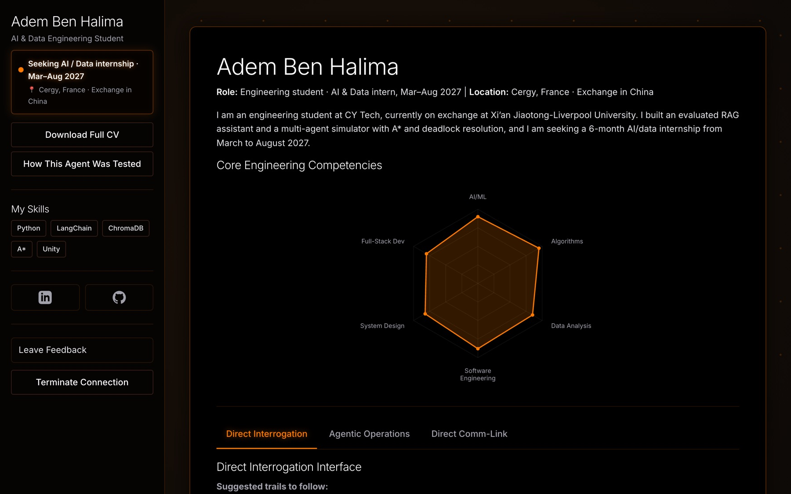

# 🦊 Kitsune Agent

An AI "digital twin" portfolio site. Recruiters type their company name, and the site answers questions about my CV, draws a skills radar weighted for their company, scores job-description fit, drafts cover letters, and can forward a message straight to my phone.

**Stack:** Python (Starlette + Uvicorn) · plain HTML/CSS/JS (no framework, no build step) · Mistral AI for chat and embeddings · Telegram for alerts and the owner login code.



## Features

- **Direct Interrogation:** a RAG chatbot that answers only from the CV and a curated knowledge file, with guardrails against prompt injection.
- **Competencies radar:** skills re-weighted for the visitor's company by the LLM. You can also write them yourself or turn them off (see below).
- **Agentic Operations:** paste a job description and get a fit score, a cover letter or interview questions.
- **Direct Comm-Link:** visitors message my phone through Telegram, and I reply from there.
- **Owner command center:** analytics, chat logs, a CMS for all site text, CV upload with AI-drafted copy, an interview simulator, and a knowledge-base editor.
- **Private areas:** themed spaces for family, each behind its own passphrase.
- **Test report:** `/report` shows how the agent was evaluated.

## Quick start

```bash
python3 -m venv .venv && source .venv/bin/activate
pip install -r requirements.txt
cp .env.example .env          # then fill in the values
export COOKIE_SECURE=0 DEV_PRINT_OTP=1   # local http only; prints the owner code in the terminal
python -m uvicorn app.main:app --port 8000
```

Open <http://localhost:8000>. Run the tests with `python -m unittest tests.test_app`.

### Docker

```bash
docker build -t kitsune .
docker run -p 8000:8000 --env-file .env -v kitsune-data:/data kitsune
```

## Configuration

All secrets come from environment variables or `.env`, which is never committed. See [`.env.example`](.env.example).

| Variable | Purpose |
| --- | --- |
| `SECRET_KEY` | Session signing key (long, random) |
| `ADMIN_PASSWORD` | Owner console password |
| `MISTRAL_API_KEY` | LLM and embeddings |
| `TELEGRAM_TOKEN`, `TELEGRAM_CHAT_ID` | Owner login codes, alerts, Comm-Link replies |
| `SARA_PASSPHRASE`, `EGI_PASSPHRASE` | Private areas (leave empty to disable) |
| `ADMIN_TRIGGER` | Phrase that opens the owner login (default `sudo override`) |
| `COOKIE_SECURE` | `1` in production (HTTPS), `0` for local http |
| `TRUST_PROXY` | `1` behind Render, Fly or nginx so rate limits see real IPs |

## How the doors work

Everything starts at the company box.

- **A company name** opens the normal visitor view.
- **`sudo override`** (or your `ADMIN_TRIGGER`) asks for `ADMIN_PASSWORD`, then a 6-digit code sent to Telegram. The phrase alone grants nothing.
- **`wife` / `egi`** (or `SARA_TRIGGER` / `EGI_TRIGGER`) shows that door's riddle. The answer must match its passphrase.

## Managing skills from the owner console

Log in with `sudo override`, open **CMS & Identity**, then press **Inject Overrides** to save:

| Setting | Effect |
| --- | --- |
| **Show skills** | Off hides the "My Skills" badges and the competencies radar for everyone |
| **Use my skills below** | On replaces the AI-generated skills with your own list |
| **Skill badges** | Comma-separated, e.g. `Python, RAG, SQL` |
| **Radar skills** | One `Name: score` per line (score 0 to 100), 3 to 10 lines |

## Editing content

- **CV:** edit `tools/resume.yaml`, then run `python tools/build_resume.py` (needs `pyyaml` and `reportlab`) to rebuild `data/resume.txt` and `data/resume.pdf`. You can also upload a CV from the console's **Profile Sync** tab.
- **Site text, personas, colours:** editable live in **CMS & Identity**.
- **Chatbot knowledge:** `data/my_brain.txt`, or the **Vector Brain Injection** tab.

## Security

- Server-side sessions with HttpOnly, SameSite=Strict cookies
- CSRF origin checks, rate limits and a strict Content Security Policy
- Two-step owner login: 5 tries per code, codes expire after 5 minutes
- Secrets only from the environment

Run exactly **one** worker, because sessions and codes live in memory, and serve it behind HTTPS.

## Project layout

```
app/        Starlette backend (API, RAG, resume, security, Telegram)
frontend/   index.html, css/, js/ and the /report page
data/       CV, knowledge base and runtime state (private files are git-ignored)
tools/      CV YAML and the PDF builder
tests/      integration tests (Mistral and Telegram are stubbed)
```
